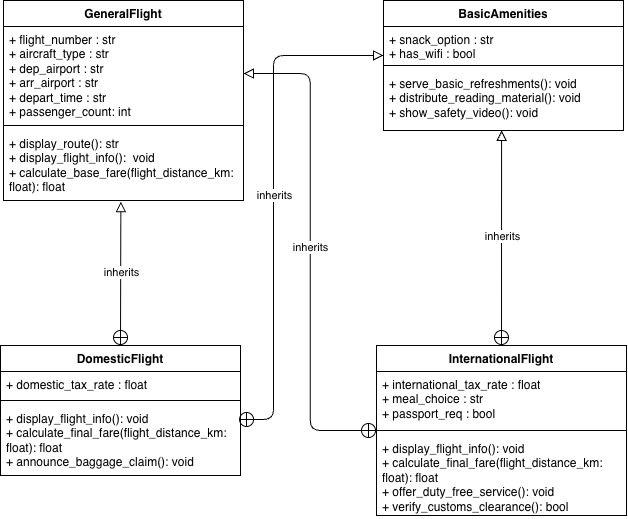

# Air New Zealand Flight Management System

## Project Overview
This project is a Python-based Object-Oriented Programming (OOP) application that simulates a flight management system for Air New Zealand. The primary goal of this project is to demonstrate the practical application of **Hybrid Inheritance** (a combination of Hierarchical and Multiple Inheritance) within software architecture. 

The system efficiently manages both Domestic and International flights by sharing core data and services while allowing for route-specific specializations.

## Core Architecture & Hybrid Inheritance
The system is built on four core classes, demonstrating a robust multiple-inheritance structure where both child classes inherit from two distinct parent classes:

* **`GeneralFlight` (Parent Class 1):** Manages core flight logistics shared globally (e.g., flight number, aircraft type, departure/arrival airports, departure time, passenger count) and calculates the baseline distance-based fare.
* **`BasicAmenities` (Parent Class 2):** A modular class managing shared in-flight services provided across the airline, such as basic refreshments, reading materials (Kia Ora magazine), and safety video broadcasts.
* **`DomesticFlight` (Child Class 1):** Inherits from both `GeneralFlight` and `BasicAmenities`. It extends the system to handle domestic tax calculations and domestic baggage claim announcements.
* **`InternationalFlight` (Child Class 2):** Inherits from both `GeneralFlight` and `BasicAmenities`. It extends the system to handle complex international surcharges, passport verifications, duty-free shopping, full meal selections, and customs clearance data processing.

### Inheritance Structure 


## Project Files

* `classes_nz_airline.py`: Contains the core OOP business logic, class definitions, method overriding, and explicit parent constructor initialization.
* `main.py`: The execution script that instantiates the flight objects and prints detailed, formatted output to the console to verify the inheritance logic.

## Features

* **Dynamic Fare Calculation:** Computes final ticket prices based on flight distance, base rates, fixed surcharges, and specific domestic/international tax rates.
* **Service Polymorphism:** Demonstrates how child classes can override inherited methods (`display_flight_info`) while utilizing `super()` to retain base logic and `self` to call inherited utility methods.
* **Customs & Border Control:** Simulates sending passenger manifests to border control for international routes.

## How to Run

Ensure you have **Python 3.x** installed on your machine. No external libraries are required.

1. Clone this repository or download the source code files to your local machine.
2. Open your terminal or command prompt.
3. Navigate to the project directory.
4. Execute the main program by running the following command:

```bash
python main.py

```

Upon execution, the console will output a formatted breakdown comparing a Domestic flight (Auckland to Christchurch) and an International flight (Auckland to Sydney), detailing their specific fares, tax rates, and in-flight amenities.

