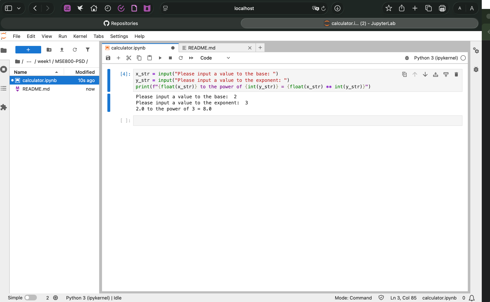
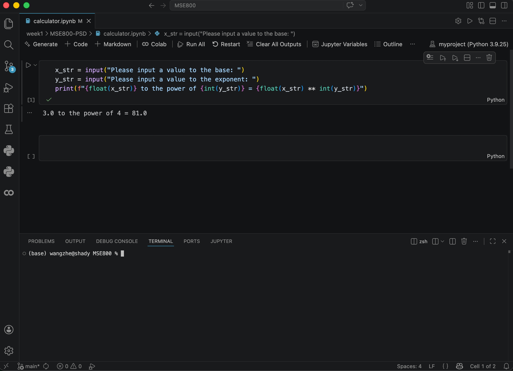
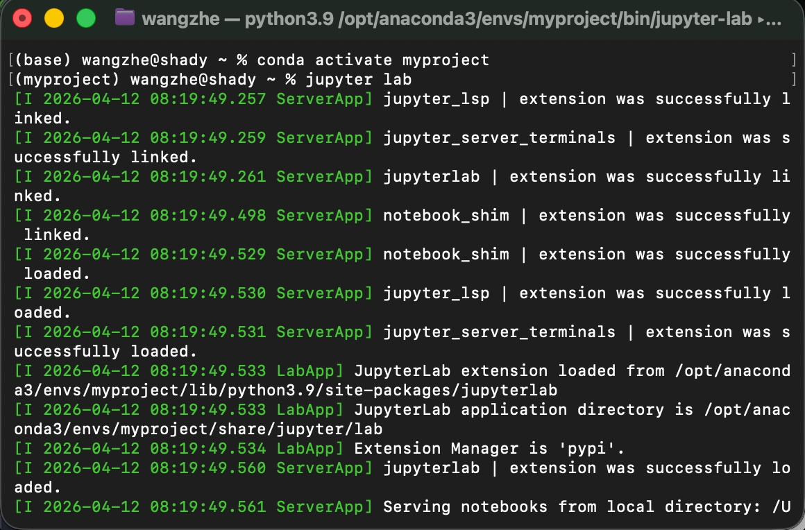

# Week 1 - Activity 3: Power Calculator Project

## Description
This is my first Python project for Week 1. It contains a simple Python script to calculate the power of a given number (x^y). 

## Operating System: 
- macOS

## Environment Setup and Result
Below is a screenshot of my current Jupyter Lab environment, showing the successful execution of the code:

